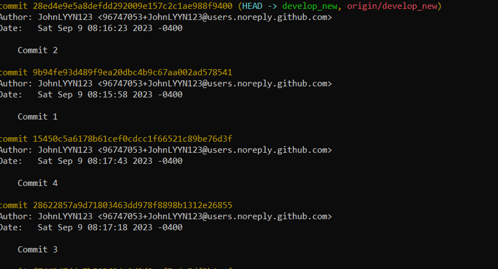

## ECE444 Assignment 1 (individual) -- self-assessment
Student Name: Yihang Lin

### Activity 1: Create Repo and Commit

### Activity 2: Branching and merging

### Activity 3: Issue, PRs, and Merge Conflicts
PR conflict resolved

Successful merge from develop to main

### Activity 4: Unit Test
Commit histories for Activity 4

### Activity 5: Git Rebase
For this activity, please refer to branches develop_new and rebase_new for changes in code

#### Before git rebase
Commits in rebase_new

Commits in develop_new

#### after git rebase
On the rebase_new branch:

On the develop_new branch:

